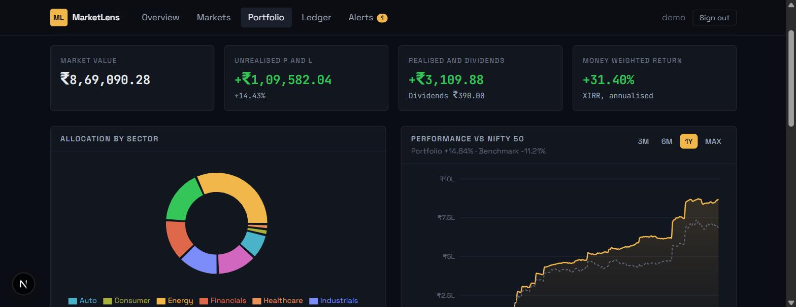
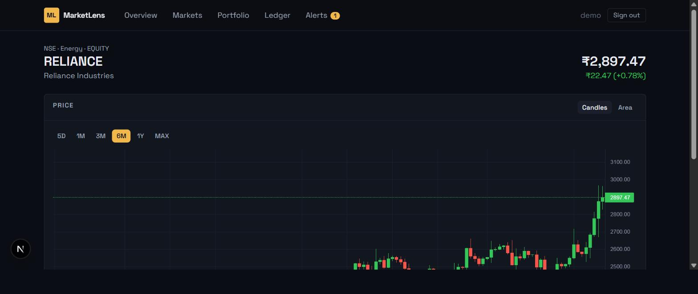
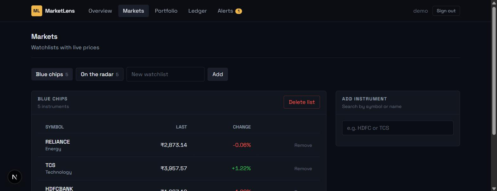
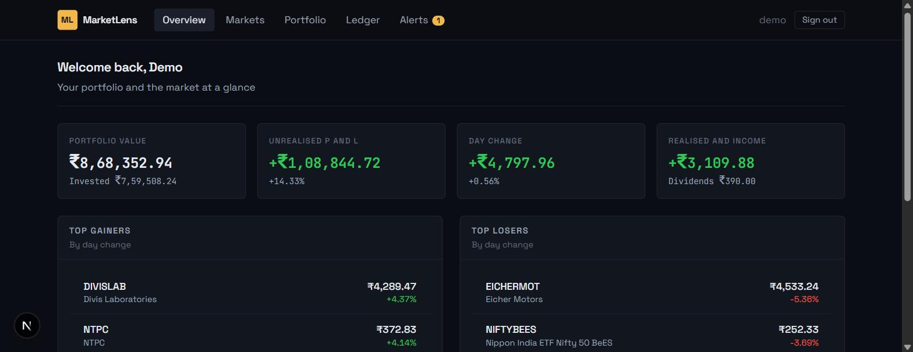
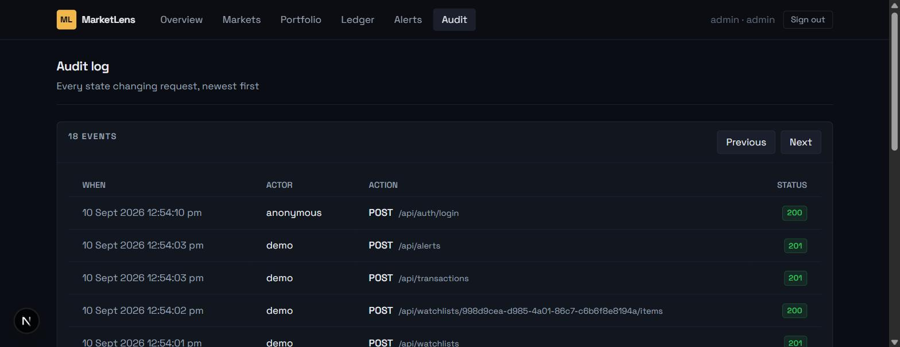

# MarketLens

A markets and portfolio dashboard. Track instruments on watchlists, view
interactive price charts, record your holdings and trades, and see portfolio
performance, allocation and profit and loss with proper return math. It is a
tracker and analytics tool, not a broker, so there is no real order execution.

This is a personal project built to practice full stack development with Next.js
and Spring Boot. It was built in stages, one module at a time.

## Screens

The portfolio view with allocation by sector and performance against the Nifty 50.



An instrument with its candlestick chart and range controls.



Watchlists with prices that update live over server sent events.



The overview dashboard.



The audit log, for administrators.



## What is built

| Module | State |
| --- | --- |
| Project setup and local environment | done |
| Authentication | done |
| Instrument master and search | done |
| Market data simulator and price history | done |
| Instrument detail and charts | done |
| Live quotes over server sent events | done |
| Watchlists | done |
| Transaction ledger | done |
| Portfolio holdings and profit and loss | done |
| Allocation, performance and money weighted return | done |
| Price alerts | done |
| Optional real market data provider | done |
| Audit trail and deployment config | done |

On a fresh database the backend generates about a year of simulated price history
for every instrument, then moves prices on a timer so charts and the live quote
grid have something to show. Market data comes through a `MarketDataProvider`
interface; the default is the simulator, and a Finnhub implementation is selected
by setting `marketlens.marketdata.provider=finnhub` with an API key.

## Tech stack

Backend

- Java 21
- Spring Boot 3.5 (Web, Data JPA, Security, Validation, Actuator)
- PostgreSQL 16
- Flyway for database migrations
- JWT access and refresh tokens
- Maven, through the Maven wrapper
- JUnit 5 and Testcontainers for tests

Frontend

- Next.js with the App Router and TypeScript
- TanStack Query for server state
- Tailwind CSS
- lightweight-charts for price charts, Recharts for the portfolio charts

## Repository layout

```
backend/    Spring Boot API
frontend/   Next.js app
docs/       Design notes and screenshots
```

## Prerequisites

- JDK 21 or newer
- Node.js 20 or newer
- Docker and Docker Compose, for the local PostgreSQL instance

## Running locally

### 1. Start PostgreSQL

```
docker compose up -d
```

PostgreSQL is published on host port 5435. Adminer is on http://localhost:8082
(server `db`, user `marketlens`, password `marketlens`, database `marketlens`).

### 2. Start the backend

```
cd backend
./mvnw spring-boot:run
```

On Windows Command Prompt use `mvnw spring-boot:run`, on PowerShell `.\mvnw spring-boot:run`.

The API runs on http://localhost:8090, on a non default port so it does not clash
with other local services. Set `SERVER_PORT` to change it.

### 3. Start the frontend

```
cd frontend
npm install
npm run dev
```

The app runs on http://localhost:3000 and proxies `/api` and `/actuator` to the
backend.

## Demo account

Created on a fresh database, with a ready made portfolio, two watchlists and a
couple of price alerts:

- username `demo`, password `demo12345`

An admin account `admin` / `admin12345` can also see the audit log. New sign ups
through the register screen are regular users.

## Trying it

1. Sign in as `demo`, or register a new account.
2. Open Markets to see the watchlists. Prices update on their own every few
   seconds.
3. Click a symbol to open its detail page and switch chart ranges.
4. Go to Transactions and record a buy. It shows up in the portfolio right away.
5. Open Portfolio to see holdings, allocation by sector, performance against the
   Nifty 50 and the money weighted return.
6. Set a price alert on Alerts. The evaluation job checks it against the latest
   prices on the next tick.

## Tests

Backend:

```
cd backend
./mvnw test
```

The tests start a throwaway PostgreSQL container, so Docker must be running.

Frontend:

```
cd frontend
npm run lint
npm run build
```

## Running the whole stack in containers

```
docker compose -f compose.prod.yaml up --build
```

The app is served on http://localhost:3000. The backend runs with the `prod`
profile. Set `JWT_SECRET`, `ADMIN_PASSWORD` and `DEMO_PASSWORD` for anything
beyond a local trial.

## Deploying to a cloud provider

- Database: a managed PostgreSQL instance. Point `DB_URL`, `DB_USERNAME` and
  `DB_PASSWORD` at it.
- Backend: deploy `backend/` as a container or run the jar from
  `./mvnw clean package`. Set the environment variables above and
  `SPRING_PROFILES_ACTIVE=prod`.
- Frontend: deploy `frontend/Dockerfile`, or `npm run build` and run
  `node .next/standalone/server.js`. Point `API_PROXY_TARGET` at the backend URL.

## License

MIT. See [LICENSE](LICENSE).
